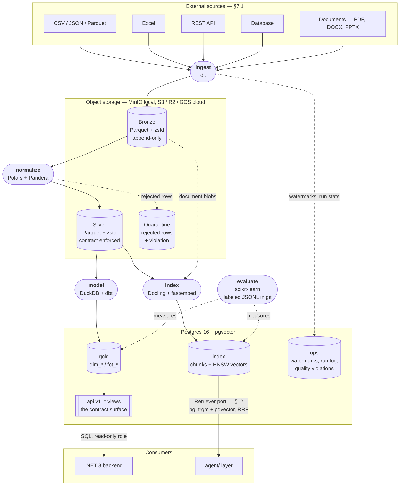

# Data Architecture Standard — Beyond Intelligence

> Architecture and coding standard for the `data/` layer (**Platform 1 — Data Intelligence**), designed to be reused across AI projects: the business content changes, the frame does not.

**Version:** 1.0
**Date:** 12/08/2026
**Applies to:** the `data/` directory
**Companion documents:** [tech-stack-evaluation.md](tech-stack-evaluation.md) — why each tool was chosen · [agent-architecture-standard.md](../docs/architecture/agent-architecture-standard.md) — the same standard for the `agent/` layer
**Theoretical basis:** Clean Architecture + Ports & Adapters (as established for `agent/`) applied to the five-stage data lifecycle (generation → storage → ingestion → transformation → serving), with medallion layering.

---

## 1. Purpose and scope

The `data/` layer owns the **Sense** step of the platform's philosophy (`Sense → Understand → Reason → Simulate → Decide → Act → Learn`). It takes messy, untyped outside data — CSVs, API responses, database rows, documents — and turns it into two trusted products:

1. **Structured data** the backend and the simulation layer can query.
2. **Retrievable knowledge** document chunks go into the retrieval index for the agent layer to search.

### In scope

| Responsibility                                    | Where it is specified |
| ------------------------------------------------- | --------------------- |
| Ingest CSV, Excel, JSON, API, Database, Documents | §7.1                  |
| Validation and data quality                       | §10                   |
| Cleaning, typing, deduplication, normalization    | §7.2                  |
| Data integration and modelling                    | §7.3                  |
| Feature / analytics tables                        | §7.3                  |
| Chunking, embedding, indexing for retrieval       | §7.4, §12             |
| Retrieval implementation behind the agent's port  | §12                   |
| Data contracts toward the backend                 | §9, §11               |
| Pipeline observability and lineage                | §13                   |
| The evaluation harness (DE half of Platform 7)    | §7.5                  |

### Explicitly out of scope

- **Reasoning over the data.** Context construction, planning and decision generation belong to `agent/`. This layer returns documents and rows; it never interprets them.
- **Streaming.** Everything here is batch or micro-batch. §17 states the trigger for revisiting that.
- **Being a warehouse migration.** No attempt to consolidate all company data. One pipeline per dataset that a consumer actually asked for.
- **Pitch and business-case material.** `business/` holds the hackathon's problem framing, market sizing and go-to-market case — pitch content, not runtime configuration. It is not a dependency of this layer.

---

## 2. Architectural stance

This layer uses Clean Architecture (also called Ports & Adapters). The goal is simple:

> **Business rules must not depend on tools such as dlt, DuckDB, Postgres, MinIO or Dagster. Tools plug into the business rules through small interfaces called ports.**

This separation lets us test pipelines without external services and replace a tool without rewriting business logic.

### The four layers

```text
orchestration/       starts a use case (Dagster, CLI)
       │
       ▼
application/         coordinates the steps (ingest, normalize, model, index, evaluate)
       │
       ▼
domain/              defines data concepts, rules and ports
       ▲
       │ implements the ports
infrastructure/      talks to tools and external systems
```

A run follows the diagram from top to bottom:

1. **Orchestration starts it.**
2. **Application coordinates it.**
3. **Domain defines what is valid.**
4. **Infrastructure performs external I/O.**

| Layer | Main question | Contains | May depend on |
| --- | --- | --- | --- |
| `orchestration/` | Who starts the work, and when? | Dagster assets, schedules, partitions and CLI commands | Application |
| `application/` | What steps does the use case perform? | The five pipelines in §7 and their supporting services | Domain; processing engines such as Polars and DuckDB |
| `domain/` | What do the data concepts mean, and what is valid? | Entities, policies and port definitions (§6) | Standard library, Pydantic and Arrow boundary types |
| `infrastructure/` | How do we talk to a specific external system? | dlt sources, database adapters, object storage and model adapters | Domain ports; any required SDK, driver or framework |

#### `orchestration/`: start the work

This layer decides when and with which parameters a pipeline runs, for example: “normalize partition `2026-08-12` and retry twice.” It must not contain transformation logic.

A Dagster asset should normally do only two things: call an application pipeline and return its result as metadata.

#### `application/`: coordinate the work

Each pipeline is one use case written as a clear sequence, for example:

1. Read a batch.
2. Validate it.
3. Separate valid and invalid rows.
4. Write both results.

Application code uses domain ports such as `Source` and `Sink`. It may use processing engines such as Polars or DuckDB, but it must not open a specific database connection or call a vendor SDK directly.

#### `domain/`: define meaning and rules

The domain is the stable core. It contains:

- **Entities and policies**, such as `DataContract`, `PartitionKey` and `QualityPolicy`.
- **Ports**, such as `Source` and `Sink`, which describe required capabilities without naming a tool.

Domain code is plain data and pure logic: it does not open files, run queries or use the network.

A practical test: if a rule cannot be unit-tested without a database, filesystem or orchestration framework, it probably does not belong in `domain/`.

#### `infrastructure/`: connect real tools

Infrastructure implements the domain ports with concrete tools. For example:

- `api_source.py` calls dlt.
- `pgvector_retriever.py` runs vector SQL.
- `fsspec_object_store.py` connects to MinIO or S3.

Infrastructure depends on the domain's port definitions. The domain never depends on infrastructure.

### Dependency inversion

The domain defines what it needs; infrastructure supplies it. Never the reverse.

```python
# Application knows only the ports.
def ingest(source: Source, sink: Sink, window: TimeWindow) -> RunStats:
    for batch in source.read(window, since=catalog.watermark(source.name)):
        sink.write(batch, partition=PartitionKey.from_window(window))

# Application must never contain tool-specific I/O such as:
dlt.pipeline(destination="duckdb").run(...)
duckdb.connect().execute("COPY ...")
psycopg.connect(...).cursor().execute(...)
```

`Source` is a `Protocol` (§6). The dlt import and calls belong in `infrastructure/sources/api_source.py`. This gives us:

1. **Fast tests.** Pass fake `Source` and `Sink` implementations; no Postgres, MinIO or network is needed (§16).
2. **Replaceable tools.** To replace dlt or pgvector, add another adapter that implements the same port. Application callers do not change.

Concrete adapters are connected to pipelines in one place: `orchestration/resources.py`, the composition root (§18). Everywhere else, application code sees only the port.

This indirection is justified because `data/` is a reusable platform expected to add sources and replace tools. It would be unnecessary for a one-off script that imports a single CSV.

### Hard boundaries

`data/domain/` must not import:

- ingestion or orchestration frameworks: `dlt`, `dagster`, `dbt`
- database or filesystem clients: `duckdb`, `psycopg`, `sqlalchemy`, `s3fs`, `fsspec`
- parsing or model libraries: `docling`, `fastembed`, `pymupdf`
- dataframe engines: `polars`, `pandas`

> **Use frameworks at the edges, not at the core.**

**Arrow exception:** domain ports may use `pyarrow`-backed types, such as `RecordBatch`, as a neutral boundary format (§6). They must not use `pl.DataFrame` or `pandas.DataFrame`; logic that needs those types belongs in `application/`.

### Keep orchestration thin

Dagster starts and monitors work; it does not perform the transformation.

```python
# Wrong: transformation logic is trapped inside Dagster.
@asset
def silver_orders(context):
    raw = pl.read_parquet(...)
    clean = raw.filter(...)
    context.log.info(...)
    return clean.write_parquet(...)

# Right: Dagster calls a plain application function.
@asset(partitions_def=daily)
def silver_orders(context, store: ObjectStore) -> MaterializeResult:
    stats = normalize_orders(store, partition=context.partition_key)
    return MaterializeResult(metadata=stats.as_dagster_metadata())
```

**Compliance check:** every function in `application/pipelines/` must be callable from a plain `pytest` test with no Dagster import. If it cannot, pipeline logic has leaked into orchestration.

---

## 3. Medallion layering

Four layers. The first three are the standard medallion pattern; the fourth exists because this platform serves an agent, not only a dashboard.

```
                    EXTERNAL SOURCES
        CSV · Excel · JSON · REST API · Database · Documents
                            │
                            ▼
┌───────────────────────────────────────────────────────────┐
│ BRONZE — raw, append-only, schema-on-read                 │
│ Mirrors the source exactly. Never edited, never deleted   │
│ before retention. Every future bug is fixable by          │
│ reprocessing from here instead of re-fetching.            │
└───────────────────────────┬───────────────────────────────┘
                            ▼
┌───────────────────────────────────────────────────────────┐
│ SILVER — typed, deduplicated, schema-on-write             │
│ One table per entity. Contract enforced at write time.    │
│ PII tagged. Failures quarantined, not dropped.            │
└───────────────┬───────────────────────────┬───────────────┘
                ▼                           ▼
┌───────────────────────────┐  ┌────────────────────────────┐
│ GOLD — modelled for       │  │ INDEX — chunks + vectors    │
│ consumption, stable       │  │ for retrieval. Rebuildable  │
│ schema, SLA-backed        │  │ from Silver at any time.    │
└───────────┬───────────────┘  └────────────┬───────────────┘
            ▼                               ▼
    api.v1_* views (§11)            Retriever port (§12)
            │                               │
      .NET backend                    agent/ layer
```

| Layer      | Physical store              | Format                   | Engine that writes it                        | Schema posture | Mutability          |
| ---------- | --------------------------- | ------------------------ | -------------------------------------------- | -------------- | ------------------- |
| Bronze     | Object storage (MinIO / S3) | Parquet + zstd           | dlt                                          | on read        | append-only         |
| Silver     | Object storage              | Parquet + zstd           | Polars                                       | on write       | partition overwrite |
| Gold       | Postgres `gold` schema      | Postgres tables          | DuckDB + dbt, published by `publish_service` | on write       | MERGE by key        |
| Index      | Postgres `index` schema     | tables + `pgvector` HNSW | embed pipeline                               | on write       | upsert by chunk id  |
| Quarantine | Object storage              | Parquet + zstd           | Polars                                       | on read        | append-only         |

**Bronze is not optional.** It is tempting to skip it when a pipeline reads one CSV. Don't. Bronze is what makes "we had a bug in the normalizer for three days" a fifteen-minute reprocess instead of a conversation about whether the source still has the data.

**Index is derived, never authoritative.** Deleting the whole `index` schema and rebuilding it from Silver must always be a safe operation. Nothing may be stored only in the index.

---

## 4. Technology stack and physical topology

### The stack, end to end

§3 showed what each layer *means*; this shows how data actually moves through it, which pipeline moves it, and which tool does the work.



The five rounded nodes are the pipelines of §7, each labelled with the tool that implements it; cylinders are stores and the yellow boxes are the systems they live in. Solid arrows are the main data path, dashed ones are side paths — quarantine, document blobs, operational metadata, measurement. Dagster does not appear as a box because it is not in the data path: it schedules and monitors all five pipelines, which is §13's subject.

### Stack decisions

| Concern | Tool | Specified in |
| --- | --- | --- |
| Ingestion adapters | dlt | §7.1 |
| Normalize engine | Polars | §7.2 |
| Frame contracts | Pandera | §9, §10 |
| Record contracts, JSON Schema export | Pydantic v2 | §9, §11 |
| SQL modelling | DuckDB + dbt-core | §7.3 |
| Object storage | MinIO local, S3 / R2 / GCS cloud, via `fsspec` | §4 |
| File format | Parquet + zstd | §3 |
| Serving store | Postgres 16 | §11 |
| Document parsing | Docling, with `pymupdf4llm` as a fast path | §7.4 |
| Embeddings | fastembed | §7.4 |
| Vector and lexical search | `pgvector` + `pg_trgm` + `unaccent` | §12 |
| Orchestration and quality gating | Dagster — assets, asset checks | §10, §13 |
| Evaluation metrics | scikit-learn | §7.5 |
| Logging | structlog | §13 |
| Packaging, lint, tests, config | uv, Ruff, pytest, pydantic-settings | §16, §18 |

**No table format yet.** There is deliberately no Iceberg or Delta Lake here — plain Parquet partitions are enough while there is one writer per dataset and nothing needs `MERGE` or time travel. §17 records the trigger for adopting one.

Candidates considered, trade-offs and rejected alternatives are in [tech-stack-evaluation.md](tech-stack-evaluation.md); this table records only the outcome.

### Local — `infrastructure/docker-compose.yml`

```
┌──────────────────────────────────────────────────────────────┐
│  Developer laptop                                            │
│                                                              │
│  ┌────────────────┐        ┌──────────────────────────────┐  │
│  │  Dagster       │        │  MinIO                       │  │
│  │  (dagster dev) │───────▶│  bronze/ silver/ quarantine/ │  │
│  │  control plane │        │  S3 API on :9000             │  │
│  └───────┬────────┘        └──────────────┬───────────────┘  │
│          │                                │                  │
│          │  in-process compute            │ httpfs / s3fs    │
│          ▼                                ▼                  │
│  ┌────────────────┐        ┌──────────────────────────────┐  │
│  │ DuckDB         │        │  Postgres 16                 │  │
│  │ + Polars       │───────▶│  + pgvector + pg_trgm        │  │
│  │ (a file, not   │ publish│  gold · index · api · ops    │  │
│  │  a service)    │        │  :5432                       │  │
│  └────────────────┘        └──────────────┬───────────────┘  │
└─────────────────────────────────────────────┼────────────────┘
                                              │ SQL, read-only role
                                              ▼
                                    .NET 8 backend
```

Two containers (MinIO, Postgres) plus one process (`dagster dev`). DuckDB and Polars are libraries — nothing to run, nothing to keep alive.

### Cloud — the same code

Only the resource configuration changes. No pipeline code is aware of which column it is in.

| Local              | Cloud                            | What changes                    |
| ------------------ | -------------------------------- | ------------------------------- |
| MinIO on `:9000`   | S3 / R2 / GCS                    | `OBJECT_STORE_URL`, credentials |
| Postgres container | Neon / Supabase / RDS            | `DATABASE_URL`                  |
| DuckDB in-process  | DuckDB in-process                | nothing                         |
| `dagster dev`      | Dagster OSS on a container / K8s | deployment manifest only        |

**This is the whole reason `fsspec`-style URLs and a single `Settings` object are non-negotiable.** The moment a path is hard-coded to `/home/…` or `localhost`, the cloud path stops being free.

---

## 5. Directory structure

Mirrors `agent/` deliberately: an engineer who has read one layer can navigate the other.

```text
data/
│
├── domain/
│   ├── entities/
│   │   ├── dataset.py              # identity, owner, classification, retention
│   │   ├── record_batch.py         # Arrow-backed batch + provenance
│   │   ├── document.py             # ParsedDocument, DocumentBlob
│   │   ├── chunk.py                # Chunk, EmbeddedChunk
│   │   ├── data_contract.py        # name, version, fields, semantics, SLA
│   │   ├── quality_report.py       # ValidationResult, Violation
│   │   └── run_stats.py            # rows in/out/rejected, bytes, duration
│   │
│   ├── value_objects/
│   │   ├── partition_key.py
│   │   ├── time_window.py
│   │   ├── watermark.py
│   │   ├── vector.py               # dimensions + model identity
│   │   └── classification.py       # public | internal | confidential | pii
│   │
│   ├── ports/
│   │   ├── source.py
│   │   ├── sink.py
│   │   ├── object_store.py
│   │   ├── validator.py
│   │   ├── transformer.py
│   │   ├── document_parser.py
│   │   ├── chunker.py
│   │   ├── embedder.py
│   │   ├── retriever.py
│   │   └── catalog.py              # watermarks, run log
│   │
│   └── policies/
│       ├── quality_policy.py       # block | warn | quarantine
│       ├── partition_policy.py
│       ├── retention_policy.py
│       └── classification_policy.py
│
├── application/
│   ├── pipelines/
│   │   ├── ingest.py               # Source      → Bronze
│   │   ├── normalize.py            # Bronze      → Silver
│   │   ├── model.py                # Silver      → Gold
│   │   ├── index.py                # Silver/docs → Index
│   │   └── evaluate.py             # cases       → metrics + report
│   │
│   └── services/
│       ├── quality_service.py      # runs validation, applies QualityPolicy
│       ├── contract_service.py     # load, compare, export JSON Schema
│       ├── retrieval_service.py    # fuses lexical + dense legs
│       └── publish_service.py      # Gold → Postgres, MERGE by key
│
├── infrastructure/
│   ├── sources/
│   │   ├── file_source.py          # dlt filesystem: csv, jsonl, parquet
│   │   ├── excel_source.py         # custom — see §7.1
│   │   ├── api_source.py           # dlt rest_api
│   │   ├── database_source.py      # dlt sql_database
│   │   └── mock_source.py          # for unit tests
│   │
│   ├── storage/
│   │   ├── fsspec_object_store.py  # MinIO / S3 / local, one adapter
│   │   ├── object_store_sink.py    # Sink over ObjectStore (bronze, silver)
│   │   ├── duckdb_engine.py
│   │   └── postgres_sink.py        # Sink into Postgres (gold, index)
│   │
│   ├── parsing/
│   │   ├── docling_parser.py
│   │   └── pymupdf_parser.py       # fast path for text-only PDF
│   │
│   ├── chunking/
│   │   └── docling_chunker.py
│   │
│   ├── embedding/
│   │   ├── fastembed_embedder.py
│   │   ├── api_embedder.py
│   │   └── mock_embedder.py        # deterministic, for tests
│   │
│   ├── retrieval/
│   │   ├── pgvector_retriever.py   # dense leg
│   │   ├── lexical_retriever.py    # pg_trgm + FTS leg
│   │   └── hybrid_retriever.py     # RRF fusion
│   │
│   ├── validation/
│   │   └── pandera_validator.py
│   │
│   └── catalog/
│       └── postgres_catalog.py     # ops.ingestion_watermark, ops.run_log
│
├── orchestration/                  # Dagster — the interface layer
│   ├── definitions.py              # the single Definitions object
│   ├── resources.py                # composition root (§18)
│   ├── partitions.py
│   ├── schedules.py
│   ├── asset_checks.py
│   └── assets/
│       ├── bronze.py
│       ├── silver.py
│       ├── gold.py
│       ├── index.py
│       └── evaluation.py
│
├── transformations/                # dbt project
│   ├── dbt_project.yml
│   ├── profiles.yml
│   └── models/
│       ├── staging/                # stg_<source>__<entity>
│       ├── intermediate/           # int_<entity>__<verb>
│       └── marts/                  # dim_<entity>, fct_<event>
│
├── contracts/
│   ├── pydantic/                   # record-level models
│   ├── pandera/                    # frame-level schemas
│   └── jsonschema/                 # GENERATED — consumed by .NET (§11)
│
├── evaluation/
│   ├── datasets/                   # labeled cases, JSONL, in git
│   ├── metrics/
│   ├── runners/
│   └── reports/                    # GENERATED
│
├── config/
│   └── settings.py                 # the single Settings object
│
├── observability/
│   ├── logging.py
│   └── tracing.py
│
└── tests/
    ├── unit/                       # no network, no DB, mock adapters
    ├── integration/                # real DuckDB, real Postgres
    ├── e2e/                        # one partition through all five pipelines
    └── fixtures/
```

---

## 6. The ports

### What is a port?

A **port** is a small interface that describes what the application needs without choosing a specific tool. For example, the application needs “something that can read records,” but it should not care whether those records come from a CSV file, an API or a database.

In this project, ports are written as Python `Protocol` classes.

### What is a `Protocol` class?

`Protocol` comes from Python's `typing` module. It lists the attributes and methods an object must provide. A concrete class satisfies the protocol by having the same shape; it does not need to inherit from the protocol.

```python
from typing import Iterator, Protocol


class Source(Protocol):
    @property
    def name(self) -> str: ...

    def read(self, window: TimeWindow, since: Watermark | None) -> Iterator[RecordBatch]: ...


# This class satisfies Source because it provides name and read().
# It does not need to write "class CsvSource(Source)".
class CsvSource:
    @property
    def name(self) -> str:
        return "orders_csv"

    def read(self, window: TimeWindow, since: Watermark | None) -> Iterator[RecordBatch]:
        yield from read_csv_batches("orders.csv")


def ingest(source: Source, window: TimeWindow) -> None:
    for batch in source.read(window=window, since=None):
        process(batch)


ingest(CsvSource(), window)  # Accepted because CsvSource matches Source.
```

This is called **structural typing**: compatibility is based on what an object can do, not what it inherits from.

The roles are:

- **Port:** the required behavior, such as `Source`.
- **Adapter:** a concrete implementation, such as `CsvSource`, `ApiSource` or `MockSource`.
- **Application pipeline:** accepts the port and works with any matching adapter.

Use a port only at a boundary where implementations are expected to change or where a fake implementation is useful in tests. Do not create a `Protocol` for every class (see the agent standard §4).

### Port definitions

```python
from typing import Protocol, Iterator, Sequence, Mapping


class Source(Protocol):
    """Reads records from outside the platform. One adapter per source type."""

    @property
    def name(self) -> str: ...

    def read(self, window: TimeWindow, since: Watermark | None) -> Iterator[RecordBatch]: ...


class Sink(Protocol):
    """Writes a batch to a layer. Must be idempotent for a given partition."""

    def write(self, batch: RecordBatch, partition: PartitionKey) -> RunStats: ...


class ObjectStore(Protocol):
    """The only way the layer touches object storage. Local, MinIO and S3
    are all the same adapter with a different URL."""

    def read_parquet(self, path: str) -> RecordBatch: ...
    def write_parquet(self, path: str, batch: RecordBatch) -> int: ...
    def list(self, prefix: str) -> list[str]: ...
    def delete_prefix(self, prefix: str) -> int: ...   # partition overwrite (§8)


class Validator(Protocol):
    """Checks a batch against a contract. NEVER raises on bad data --
    it returns a report and lets QualityPolicy decide (§10)."""

    def validate(self, batch: RecordBatch, contract: DataContract) -> ValidationResult: ...


class Transformer(Protocol):
    """A named, pure step in the normalize pipeline."""

    @property
    def name(self) -> str: ...

    def apply(self, batch: RecordBatch) -> RecordBatch: ...


class DocumentParser(Protocol):
    def parse(self, blob: DocumentBlob) -> ParsedDocument: ...
    def supports(self, media_type: str) -> bool: ...


class Chunker(Protocol):
    def chunk(self, document: ParsedDocument) -> list[Chunk]: ...


class Embedder(Protocol):
    @property
    def model_id(self) -> str: ...

    @property
    def dimensions(self) -> int: ...

    def embed(self, texts: Sequence[str]) -> list[Vector]: ...


class Retriever(Protocol):
    """MUST stay structurally compatible with agent/domain/ports/retriever.py --
    see §12.3. This is the one port shared across two layers."""

    async def retrieve(
        self, query: str, top_k: int, filters: Mapping[str, object] | None = None
    ) -> list[RetrievedChunk]: ...


class Catalog(Protocol):
    """Operational metadata. Watermarks live here, never on local disk."""

    def watermark(self, dataset: str) -> Watermark | None: ...
    def commit(self, dataset: str, watermark: Watermark, stats: RunStats) -> None: ...
```

### Adapter table

| Port             | Adapters                                                                      | Notes                                                          |
| ---------------- | ----------------------------------------------------------------------------- | -------------------------------------------------------------- |
| `Source`         | `file_source`, `excel_source`, `api_source`, `database_source`, `mock_source` | §7.1 maps these to the six required source types               |
| `Sink`           | `object_store_sink`, `postgres_sink`                                          | both idempotent per partition                                  |
| `ObjectStore`    | `fsspec_object_store`                                                         | one adapter covers local, MinIO, S3, R2, GCS                   |
| `Validator`      | `pandera_validator`                                                           |                                                                |
| `DocumentParser` | `docling_parser`, `pymupdf_parser`                                            | dispatch on `supports()`                                       |
| `Chunker`        | `docling_chunker`                                                             |                                                                |
| `Embedder`       | `fastembed_embedder`, `api_embedder`, `mock_embedder`                         | `mock_embedder` is deterministic so retrieval tests are stable |
| `Retriever`      | `pgvector_retriever`, `lexical_retriever`, `hybrid_retriever`                 | `hybrid_retriever` composes the other two                      |
| `Catalog`        | `postgres_catalog`                                                            |                                                                |

`mock_source` and `mock_embedder` are not an afterthought — they are what make the unit tier of §16 possible.

---

## 7. The five pipelines

Mapping to the required `Source → Ingestion → Validation → Normalization → Storage → Feature/Analytics` flow:

| Required stage      | Pipeline                                                           |
| ------------------- | ------------------------------------------------------------------ |
| Source, Ingestion   | `ingest` (§7.1)                                                    |
| Validation          | the Bronze→Silver boundary in `normalize`, plus asset checks (§10) |
| Normalization       | `normalize` (§7.2)                                                 |
| Storage             | the layers of §3, written by each pipeline's sink                  |
| Feature / Analytics | `model` (§7.3), and `index` (§7.4) for retrieval                   |

### 7.1 `ingest` — Source → Bronze

|                  |                                                                                           |
| ---------------- | ----------------------------------------------------------------------------------------- |
| **Input**        | one external source, one time window                                                      |
| **Output**       | Parquet files under `bronze/<source>/<dataset>/ingested_date=…/`                          |
| **Engine**       | dlt                                                                                       |
| **Partition**    | `ingested_date` (daily) — the date we _received_ it, not the date it happened             |
| **Idempotency**  | append-only + `run_id` in the filename; duplicates are removed in `normalize`, never here |
| **Failure mode** | fail the partition loudly; never partially commit a window                                |

**Why `ingested_date` and not `event_date`:** Bronze mirrors an arrival, and arrivals are the only thing the ingestion step actually knows. Repartitioning by event time is a Silver concern, where late data can be handled deliberately.

**The six required source types:**

| Source type  | Adapter           | Mechanism                                                                                                                                                                                             |
| ------------ | ----------------- | ----------------------------------------------------------------------------------------------------------------------------------------------------------------------------------------------------- |
| CSV          | `file_source`     | dlt `readers()` → `read_csv`, or `read_csv_duckdb` for files too large for memory                                                                                                                     |
| **Excel**    | `excel_source`    | **Custom.** dlt ships no Excel reader — `filesystem()` pipes file items into a small transformer using `polars.read_excel` (calamine engine via `fastexcel`). Verified: not covered by dlt built-ins. |
| JSON / JSONL | `file_source`     | dlt `readers()` → `read_jsonl`; nested objects are normalized into child tables automatically                                                                                                         |
| REST API     | `api_source`      | dlt `rest_api_source` — declarative pagination, auth and incremental cursor                                                                                                                           |
| Database     | `database_source` | dlt `sql_database` / `sql_table`; use the `pyarrow` backend for stable destination types                                                                                                              |
| Documents    | see §7.4          | Docling; binary blobs land in Bronze unaltered, parsing happens in `index`                                                                                                                            |

**Documents land as blobs.** A PDF is copied byte-for-byte into Bronze and parsed later. Parsing is code, code has bugs, and the point of Bronze is that a parser bug costs a reprocess rather than a re-download.

**Incremental loading.** Where the source supports a cursor, `ingest` reads the last watermark from `Catalog`, requests only newer rows, and commits the new watermark _only after_ the write succeeds. Full reloads are acceptable while a dataset is small; §17 gives the trigger to stop doing that.

### 7.2 `normalize` — Bronze → Silver

|                  |                                                                                                               |
| ---------------- | ------------------------------------------------------------------------------------------------------------- |
| **Input**        | one Bronze partition (or a range, for backfill)                                                               |
| **Output**       | `silver/<entity>/event_date=…/`                                                                               |
| **Engine**       | Polars (lazy), Pandera for the contract                                                                       |
| **Partition**    | `event_date`, derived from a business timestamp                                                               |
| **Idempotency**  | delete-prefix-then-write for the target partition, in that order, one partition at a time                     |
| **Failure mode** | rows failing the contract go to `quarantine/`; the partition still publishes unless `QualityPolicy` blocks it |

Steps, in order:

1. Read the Bronze partition — **explicit column projection, never `SELECT *`**.
2. Cast to the contract's types. A cast failure is a violation, not an exception.
3. Deduplicate on the business key, keeping the latest by source timestamp.
4. Apply named `Transformer`s (trim, normalize case, parse dates, unify units).
5. Tag classification per `ClassificationPolicy` — PII is marked here, at landing, not later.
6. Validate with Pandera (`lazy=True`, so one pass reports every violation).
7. Split: valid rows → Silver, invalid rows → quarantine with the violation attached.
8. Write, then record stats through `Catalog`.

**Why explicit projection is a rule and not a preference:** `SELECT *` couples Silver to the source's column order and makes a new upstream column change Silver's schema silently. Naming columns turns an upstream addition into a visible, reviewable decision.

### 7.3 `model` — Silver → Gold

|                  |                                                                                          |
| ---------------- | ---------------------------------------------------------------------------------------- |
| **Input**        | Silver Parquet on object storage                                                         |
| **Output**       | `gold` schema tables in Postgres, then `api.v1_*` views (§11)                            |
| **Engine**       | DuckDB reading Silver via `httpfs`; models defined in dbt (`dbt-duckdb`)                 |
| **Partition**    | usually none — Gold marts are rebuilt whole while they are small                         |
| **Idempotency**  | rebuild in DuckDB, then `MERGE` into Postgres on the business key inside one transaction |
| **Failure mode** | fail before publishing; Postgres keeps the previous good version                         |

The publish step is deliberately separate from the transform step. DuckDB does the joins and aggregation over Parquet at object-storage speed; `publish_service` then moves a finished, small result into Postgres where the backend can serve it with an index. One SQL dialect for modelling, one narrow write path to production.

> **Alternative, for later:** point dbt at Postgres directly (`dbt-postgres`) and drop the publish step. Correct once Gold outgrows "rebuild the whole mart" and you need incremental models in the serving database. Not now — the publish step is what keeps a half-built mart from ever being visible to the backend.

**Modelling choice.** Default to a star schema (`dim_*` / `fct_*`) once there are multiple consumers, and to one wide table when there is exactly one consumer and no reuse. State the grain of every fact table in its dbt model description — the grain is the modelling decision that is expensive to change later.

### 7.4 `index` — Silver + documents → Index

|                  |                                                                                       |
| ---------------- | ------------------------------------------------------------------------------------- |
| **Input**        | document blobs from Bronze; text columns from Silver                                  |
| **Output**       | `index.chunk` + `index.embedding` in Postgres                                         |
| **Engine**       | Docling → `Chunker` → `Embedder` → pgvector                                           |
| **Partition**    | by source document                                                                    |
| **Idempotency**  | chunk id is a content hash; upsert on `(document_id, chunk_index, embedder_model_id)` |
| **Failure mode** | an unparseable document goes to the DLQ with its error; the run continues             |

Steps: resolve parser via `supports()` → parse → chunk → embed in batches → upsert.

**`embedder_model_id` is part of the key, not metadata.** Embeddings from two different models are not comparable, and mixing them silently degrades retrieval in a way that is very hard to notice and very easy to prevent. Changing the embedding model means a new index generation and a rebuild — cheap, because Index is derived (§3).

**A document that fails to parse is a data quality event**, not a crash. It lands in the DLQ, increments a counter, and shows up in the quality report — the same treatment as a malformed row.

### 7.5 `evaluate` — labeled cases → metrics + report

|                  |                                                                   |
| ---------------- | ----------------------------------------------------------------- |
| **Input**        | `evaluation/datasets/*.jsonl`, versioned in git                   |
| **Output**       | a metrics table + a Markdown report in `evaluation/reports/`      |
| **Engine**       | scikit-learn for the metrics, a template for the report           |
| **Idempotency**  | pure function of (dataset version, pipeline version, config)      |
| **Failure mode** | a metric below its configured threshold fails the check — visibly |

The harness runs at least two arms — a **baseline** and the **pipeline under test** — over the same cases, and reports precision, recall, F1 and the confusion matrix for each, with `n` stated.

Three properties make this worth building as a pipeline instead of a notebook:

1. **Reproducible.** The report names the dataset version, the pipeline version and the config that produced it.
2. **Re-run on change.** It is an asset with upstream dependencies, so it re-runs when they change rather than when someone remembers.
3. **Comparable.** Two arms over identical cases is the only honest way to claim an improvement.

**Labeled cases live in git, as JSONL.** Not in a database, not in a spreadsheet. Labels are source code: they get reviewed, they get diffed, and a change to them must be as visible as a change to the code they measure.

---

## 8. Idempotency and recovery

**Running any pipeline twice produces the same result as running it once.** Everything below exists to make that true, because it is what makes retries, backfills and recovery ordinary instead of frightening.

| Layer  | Mechanism                                | Why this one                                    |
| ------ | ---------------------------------------- | ----------------------------------------------- |
| Bronze | append-only, `run_id` in the filename    | never mutate raw data; duplicates die in Silver |
| Silver | `delete_prefix(partition)` then write    | one partition is the unit of atomicity          |
| Gold   | `MERGE` on business key, one transaction | consumers must never see a half-built mart      |
| Index  | upsert on content-hash chunk id          | re-embedding the same text is a no-op           |

### Rules

1. **One partition per run.** A run that writes two partitions cannot be retried safely.
2. **Delete then write, never write then delete.** A crash between the two leaves a partition empty, which a freshness check catches. The reverse order leaves duplicates, which nothing catches.
3. **Watermarks live in `ops.ingestion_watermark`.** Never on local disk — the disk is not the durable part of the system.
4. **Commit the watermark after the write succeeds.** In that order, a crash re-reads data; in the other order, a crash loses it. Re-reading is recoverable, losing is not.
5. **Never overwrite a partition a consumer is reading.** Delete-then-write inside a single partition prefix is acceptable because consumers read whole partitions; a live table overwrite is not.
6. **Never catch a broad exception and continue.** A bare `except Exception: pass` in a pipeline is silent data loss discovered hours later. Bad _records_ are routed to quarantine deliberately; bad _runs_ fail.

### Backfill

A backfill is a partition range re-run through the ordinary code path. There is no backfill script, and that is the point — a separate backfill path is a second implementation that will drift from the first.

```
# conceptually
for partition in range(start, end):
    normalize(partition)   # same function the schedule calls
```

**If replaying the last 30 days is not routine, the design is not finished.**

---

## 9. Data contracts and schema evolution

### One source of truth, two shapes

| Shape    | Tool                                  | Used for                                                   |
| -------- | ------------------------------------- | ---------------------------------------------------------- |
| Record   | Pydantic v2 (`contracts/pydantic/`)   | API payloads, config, anything crossing a service boundary |
| Frame    | Pandera (`contracts/pandera/`)        | Silver and Gold table schemas                              |
| Exported | JSON Schema (`contracts/jsonschema/`) | **generated**, consumed by the .NET backend (§11)          |

`contracts/jsonschema/` is generated output committed to git. Committing it means a contract change shows up as a reviewable diff, and the .NET side can regenerate DTOs from a file rather than from a conversation.

### A contract states more than a schema

```yaml
name: orders
version: 2.1.0
owner: data-engineering
classification: internal
fields:
  order_id: { type: string, nullable: false, unique: true }
  customer_id: { type: string, nullable: false, classification: pii }
  amount: { type: decimal, nullable: false, min: 0 }
  ordered_at: { type: timestamp, nullable: false, timezone: utc }
semantics:
  grain: one row per order
  amount: gross, in minor units, before discount
sla:
  freshness: 24h
  completeness: 0.99
```

Schema alone does not stop a consumer misreading `amount`. Semantics and SLA are the part that does.

### Evolution rules

| Change                         | Compatibility | Allowed                                                    |
| ------------------------------ | ------------- | ---------------------------------------------------------- |
| Add a nullable column          | backward      | yes, patch version                                         |
| Add a required column          | breaking      | new minor, with a default during a grace period            |
| Widen a type (`int32`→`int64`) | backward      | yes                                                        |
| Narrow a type                  | breaking      | new major                                                  |
| Rename a column                | breaking      | add the new one, dual-write, remove after the grace period |
| Remove a column                | breaking      | new major, only after consumers confirm                    |

**Additive by default. Semver. A breaking change is a new version with a grace period, never an edit in place.**

### Two prohibitions worth stating separately

- **Never silently drop an unknown column.** A producer adding a field must produce a visible event — a logged drift record and a warning check — not silence. Silence here is invisible data loss.
- **Never couple Gold to Bronze column names.** Silver exists to absorb source renames. If a Bronze rename reaches Gold, the layer boundary was skipped.

Bronze is schema-on-read: dlt infers and evolves the schema and records what changed. Silver and Gold are schema-on-write: the contract is enforced at write time and violations are quarantined.

---

## 10. Data quality

### Audit → Write → Audit → Publish

Validate before writing, validate what was written, and only then make it visible.

```
Bronze ──▶ [structural checks] ──▶ Silver staging ──▶ [full suite] ──▶ Silver published
                    │                                       │
                    ▼                                       ▼
              drift record                              quarantine
```

### Where each check runs

| Layer  | Checks                                                                                         | Cost             |
| ------ | ---------------------------------------------------------------------------------------------- | ---------------- |
| Bronze | is it readable, non-empty, roughly the expected volume, did the schema drift                   | cheap, every run |
| Silver | the full contract — types, nullability, uniqueness, ranges, referential integrity              | the main suite   |
| Gold   | dbt tests — `unique`, `not_null`, `relationships`, `accepted_values`, plus business assertions | on rebuild       |
| Index  | chunk count per document non-zero, embedding dimensions match `Embedder.dimensions`            | on rebuild       |

**Running checks only on Gold is the classic mistake**: by the time Gold fails, everything upstream is already contaminated and you cannot tell how far back.

### QualityPolicy — a domain decision

Validation produces a report. What to _do_ about the report is a policy, and it belongs in the domain where it can be tested without a database.

```python
class QualityPolicy(Protocol):
    def decide(self, result: ValidationResult) -> QualityDecision: ...
    # QualityDecision: PUBLISH | PUBLISH_WITH_WARNING | QUARANTINE_AND_PUBLISH | BLOCK
```

Default posture:

| Situation                                          | Decision                             |
| -------------------------------------------------- | ------------------------------------ |
| No violations                                      | `PUBLISH`                            |
| Row-level violations under the threshold           | `QUARANTINE_AND_PUBLISH`             |
| Row-level violations over the threshold            | `BLOCK` — something changed upstream |
| A schema-level violation (missing required column) | `BLOCK`                              |
| A freshness miss with valid data                   | `PUBLISH_WITH_WARNING`               |

**Thresholds live in `Settings`, never in code.** A hard-coded `if bad_rows > 100` breaks the first week real volume grows past it, and it breaks by blocking a healthy pipeline.

### Quarantine, not drop

Failed rows go to `quarantine/<entity>/event_date=…/` with the violation, the contract version and the run id attached, and are counted in `ops.quality_violations`. Reprocessing a fixed quarantine batch is an ordinary `normalize` run over a different prefix.

Dropping rows is indistinguishable from never having received them. Quarantine keeps the difference visible.

### Wiring to the orchestrator

Quality gates are expressed as Dagster **asset checks** — `@asset_check(blocking=True)` when a failure must stop downstream materialization, non-blocking (the default) when it should only warn. The decision lives with the asset and shows up in the UI next to it, so nobody has to go looking for whether the data is trustworthy.

---

## 11. The serving contract to the backend

The backend is .NET 8 + FastEndpoints and cannot import Python. **Postgres is the contract surface.** The data layer writes; the backend reads SQL. No Python service sits between them, so there is nothing extra to deploy and nothing extra to fail.

### Versioned views are the actual interface

```
gold.dim_customer          ← internal, refactor freely
gold.fct_order             ← internal, refactor freely
        │
        ▼
api.v1_customer_overview   ← THE CONTRACT. .NET reads only this.
api.v1_order_daily         ← additive changes only
```

| Rule                                                   | Reason                                                               |
| ------------------------------------------------------ | -------------------------------------------------------------------- |
| The backend reads only the `api` schema                | table refactors stop being cross-team events                         |
| `api` views are additive within a major version        | a new column never breaks a consumer                                 |
| A breaking change ships as `api.v2_*` alongside `v1_*` | the backend migrates on its own schedule                             |
| `v1_*` is dropped only after the backend confirms      | coordination happens once, at removal                                |
| The backend's DB role has `SELECT` on `api` only       | least privilege, and it makes the boundary real rather than advisory |

The last row is what makes this hold. A convention the backend _could_ bypass eventually gets bypassed at 2am; a permission it _cannot_ bypass stays a boundary.

### Keeping DTOs in sync

`contract_service` exports every `api.v1_*` shape to `contracts/jsonschema/`. The .NET side generates or hand-writes DTOs against those files. A contract change is then a reviewable diff in a shared file rather than a runtime surprise.

### Postgres schemas

| Schema  | Contents                                | Backend access |
| ------- | --------------------------------------- | -------------- |
| `gold`  | published marts                         | none           |
| `index` | chunks, embeddings                      | none           |
| `api`   | versioned views                         | `SELECT`       |
| `ops`   | watermarks, run log, quality violations | none           |

Silver deliberately does not appear: it stays in object storage. Postgres holds only what is served or operational, which keeps the serving database small and fast.

---

## 12. Retrieval

The data layer owns retrieval **mechanics**. The agent layer owns what to do with the results.

### 12.1 Hybrid by default

Dense-only retrieval misses exact identifiers, rare tokens and misspellings — precisely the cases where a user typed something specific and expects it back. Lexical-only retrieval misses paraphrase. Two legs, fused:

```
                   query
                     │
        ┌────────────┴────────────┐
        ▼                         ▼
┌────────────────┐      ┌──────────────────┐
│ LEXICAL leg    │      │ DENSE leg        │
│ pg_trgm        │      │ pgvector HNSW    │
│ + Postgres FTS │      │ cosine distance  │
│ + unaccent     │      │                  │
└───────┬────────┘      └────────┬─────────┘
        │      top_k each         │
        └────────────┬────────────┘
                     ▼
        Reciprocal Rank Fusion (RRF)
             score = Σ 1/(k + rank)
                     ▼
              top_k results
```

RRF fuses on **rank**, not score, which is why it needs no calibration between two legs whose scores are not on the same scale. `k` (conventionally 60) lives in `Settings`.

### 12.2 An honest limitation

**Postgres full-text search ships no Vietnamese dictionary.** There is no `vietnamese` text search configuration, so stemming and stop-words are unavailable for Vietnamese text.

The mitigation adopted here: `unaccent` + the `simple` configuration for tokenization, with `pg_trgm` trigram similarity carrying most of the lexical weight. Trigram matching is diacritic- and typo-tolerant, which covers a good deal of what a real analyzer would do — and it does so without another service.

This is a real limitation, not a solved problem. §17 names the upgrade. Anyone reporting retrieval quality on Vietnamese text should state this caveat.

### 12.3 The shared port

`agent/domain/ports/retriever.py` already defines what the agent needs. **The data layer's `hybrid_retriever` is an adapter for the agent's port** — the one place these two layers meet in code.

Consequences, both directions:

- The data layer returns objects structurally compatible with `agent/domain/entities/context.py::RetrievedDocument` — `content`, `source`, `score`, `metadata`.
- Changing that shape is a cross-layer breaking change and follows §9's rules.
- The agent never imports `psycopg` or `pgvector`, and never learns that retrieval is hybrid. Swapping the index for a different store is invisible to it.

---

## 13. Observability

### Structured logs, stdout only

No `print()`. One structured event per meaningful step, emitted to stdout; collection and routing are the environment's job (Twelve-Factor).

```python
logger.info(
    "asset_materialized",
    run_id=run_id,
    asset_key="silver/orders",
    partition="2026-08-12",
    rows_in=124_301,
    rows_out=124_288,
    rows_rejected=13,
    bytes_written=8_412_663,
    duration_ms=4_182,
    contract_version="2.1.0",
    engine="polars",
)
```

### Mandatory fields

```
run_id, asset_key, partition, source_system, dataset
contract_version, schema_version
rows_in, rows_out, rows_rejected, bytes_written
duration_ms, engine
watermark_from, watermark_to
```

### Never log

API keys, connection strings, full record payloads, or any column classified `pii`. Log the **count** of bad rows and a violation code; the rows themselves belong in quarantine, which is access-controlled. Logs are the easiest place to turn a data layer into a leak.

### The four detectors

| Detector             | Fires when                                                      | Severity                      |
| -------------------- | --------------------------------------------------------------- | ----------------------------- |
| Flow interruption    | a dataset has had no new partition for longer than its SLA      | page                          |
| Volume skew          | row count deviates more than three sigma from its trailing mean | warn, page on repeat          |
| Freshness / SLA miss | the contract's freshness budget is exceeded                     | page if a consumer has an SLA |
| Quality-rate drift   | the rejected-row ratio rises materially against its baseline    | warn                          |

**Never page on a warning**, and **never ship an alert without a runbook link**. Both produce the same outcome: alerts that get ignored, including the real ones.

### Lineage

Dagster's asset graph is the lineage graph — it is derived from the code, so it cannot drift from it. dbt contributes column-level detail within the SQL layer via its manifest.

**A hand-drawn lineage diagram is out of date by the second deploy.** The diagrams in this document are for explaining the architecture; they are not the lineage record and must not be used as one.

### Tracing

`observability/tracing.py` holds a thin interface only, so OpenTelemetry can be attached later without touching pipeline code — the same posture as the agent standard §14.

---

## 14. Security and governance

| Concern                    | Rule                                                                                                                                                 |
| -------------------------- | ---------------------------------------------------------------------------------------------------------------------------------------------------- |
| Classification             | every field carries one of `public` / `internal` / `confidential` / `pii`, set in the contract                                                       |
| PII tagging                | applied in `normalize` at landing (§7.2 step 5), never retrofitted                                                                                   |
| Secrets                    | environment variables locally, a secret manager in cloud; never in git, never in logs                                                                |
| DB roles                   | `data_writer` (pipelines: write `gold`/`index`/`ops`), `backend_reader` (`SELECT` on `api` only), `analyst_reader` (read `gold`, PII columns masked) |
| Object storage             | per-bucket credentials; the pipeline role cannot delete Bronze                                                                                       |
| Production data on laptops | prohibited — the single most common avoidable PII leak. Use `mock_source` and generated fixtures                                                     |
| Test data                  | synthetic, or a masked sample; never a production dump, and never in CI logs                                                                         |
| Retention                  | Bronze per policy, Silver aligned to Bronze, quarantine 90 days, Index rebuildable so retention is irrelevant                                        |
| Right to erasure           | a keyed delete against Silver plus a Gold rebuild plus an Index rebuild; Bronze handled per its retention policy                                     |

**Every dataset has exactly one owner**, recorded in its contract. A dataset owned by everyone is maintained by no one and becomes the on-call's problem eventually.

---

## 15. Naming conventions

Boring and predictable beats clever. These are not negotiable per-pipeline.

### Object paths

```
s3://bi-data-<env>/<layer>/<source_system>/<dataset>/<partition_col>=<value>/part-<run_id>-<n>.parquet

layer         ∈ {bronze, silver, gold, quarantine}
env           ∈ {dev, staging, prod}
partition_col = ingested_date (bronze) | event_date (silver)
```

```
s3://bi-data-prod/bronze/erp/orders/ingested_date=2026-08-12/part-a1b2c3-0.parquet
s3://bi-data-prod/silver/orders/event_date=2026-08-11/part-a1b2c3-0.parquet
```

### Postgres

| Object       | Pattern                                                            | Example              |
| ------------ | ------------------------------------------------------------------ | -------------------- |
| Schemas      | `gold`, `index`, `api`, `ops`                                      |                      |
| Dimension    | `dim_<entity>`                                                     | `gold.dim_customer`  |
| Fact         | `fct_<event>`                                                      | `gold.fct_order`     |
| Serving view | `api.v<major>_<name>`                                              | `api.v1_order_daily` |
| Index tables | `index.chunk`, `index.embedding`                                   |                      |
| Ops tables   | `ops.ingestion_watermark`, `ops.run_log`, `ops.quality_violations` |                      |

### Dagster asset keys

```
["bronze", <source_system>, <dataset>]     ["bronze", "erp", "orders"]
["silver", <entity>]                       ["silver", "orders"]
["gold",   <model>]                        ["gold", "fct_order"]
["index",  <collection>]                   ["index", "documents"]
["eval",   <suite>]                        ["eval", "extraction_v1"]
```

The asset key prefix is the layer, so the Dagster UI groups by layer with no extra configuration.

### dbt models

| Stage        | Pattern                        | Example                |
| ------------ | ------------------------------ | ---------------------- |
| Staging      | `stg_<source>__<entity>`       | `stg_erp__orders`      |
| Intermediate | `int_<entity>__<verb>`         | `int_orders__enriched` |
| Mart         | `dim_<entity>` / `fct_<event>` | `fct_order`            |

Double underscore separates the source from the entity; single underscores are word separators within each.

### Branches and columns

- Branches: `data/<type>/<slug>` — `data/feat/orders-ingest`, `data/fix/dedup-key`.
- Timestamps: `<verb>_at`, always UTC, always timezone-aware — `created_at`, `ingested_at`.
- Booleans: `is_` / `has_` — `is_active`.
- Keys: `<entity>_id` for natural keys, `<entity>_key` for surrogate keys.

---

## 16. Testing

Four tiers. The first three are ordinary software testing; the fourth exists because data quality is not a boolean.

```text
tests/
├── unit/          # no network, no DB, no files -- mock adapters. Milliseconds.
├── integration/   # real DuckDB, real Postgres in Docker, real MinIO
├── e2e/           # one partition through all five pipelines
└── (evaluation/)  # lives in evaluation/, run as an asset -- see §7.5
```

| Tier        | What it proves                                            | Rule                                                           |
| ----------- | --------------------------------------------------------- | -------------------------------------------------------------- |
| Unit        | policies, transformers, contracts, RRF fusion are correct | if it needs a container, it is not a unit test                 |
| Integration | each adapter really works against its real dependency     | real dependencies, not mocks — mocked drivers hide driver bugs |
| E2E         | the layers compose, on a tiny synthetic dataset           | must run in CI in under a few minutes                          |
| Evaluation  | quality is above threshold                                | `quality >= threshold`, not `expected == actual`               |

**The fourth tier is not optional and it is not a notebook.** Traditional tests assert equality; a retrieval or extraction pipeline has no single correct output, only a measurable quality level. `evaluation/` is therefore a component of the system with the same standing as `application/` — the same argument the agent standard makes in §15.

**Test data is synthetic.** `mock_source` and `mock_embedder` (deterministic) exist so the unit tier stays fast and the whole suite stays free of production data.

---

## 17. Evolution path

Every row here is a real ceiling with a real successor. **The trigger column exists so nobody upgrades early** — each of these upgrades costs operational complexity that is only worth paying once the ceiling is actually hit.

| Today                           | Ceiling / trigger                                                                      | Then                                                                                     |
| ------------------------------- | -------------------------------------------------------------------------------------- | ---------------------------------------------------------------------------------------- |
| Plain Parquet partitions        | concurrent writers, or a genuine need for row-level `MERGE` / time travel              | Apache Iceberg (`pyiceberg` + a REST catalog)                                            |
| DuckDB single-node              | a transform no longer fits one machine, or exceeds the time budget on a large instance | Distributed engine, or push the transform into a warehouse                               |
| Batch ingestion                 | a consumer's value genuinely depends on sub-minute freshness                           | Postgres logical replication first; Debezium + a log broker only if that is insufficient |
| pgvector                        | vector count or QPS degrades recall or latency below target                            | A dedicated vector store — accepting a second store to keep in sync                      |
| Postgres FTS + trigram          | Vietnamese lexical retrieval quality becomes the binding constraint (§12.2)            | A search engine with a real Vietnamese analyzer                                          |
| Full reload                     | reload time or source load becomes a problem                                           | Incremental with a watermark, then CDC                                                   |
| `dagster dev`                   | multiple concurrent users, or scheduled runs must survive a laptop closing             | Dagster deployed as a container, then on K8s                                             |
| Local `ops` tables              | lineage needed across teams and tools                                                  | OpenLineage emission into a catalog                                                      |
| Postgres as the analytics store | analytical queries start competing with serving queries                                | A dedicated columnar warehouse; Postgres keeps only `api`                                |

**Record why, when you do it.** Each of these is an architecture decision worth a short ADR in `docs/decisions/`. The architecture in this document is an engineering hypothesis, not a permanent truth — and the reasoning behind a change is more valuable later than the change itself.

---

## 18. Build order

### The composition root

`orchestration/resources.py` is the **only** place in `data/` allowed to name a concrete implementation — the same rule as `agent/bootstrap/container.py`.

```python
def build_resources(settings: Settings) -> dict[str, object]:
    store = FsspecObjectStore(settings.object_store_url, settings.object_store_credentials)
    catalog = PostgresCatalog(settings.database_url)
    validator = PanderaValidator()
    embedder = create_embedder(settings)      # fastembed | api | mock
    parser = create_parser(settings)          # docling | pymupdf

    return {
        "store": store,
        "catalog": catalog,
        "validator": validator,
        "embedder": embedder,
        "parser": parser,
        "retriever": HybridRetriever(
            dense=PgVectorRetriever(settings.database_url, embedder),
            lexical=LexicalRetriever(settings.database_url),
            k=settings.rrf_k,
        ),
    }
```

If `DuckDBEngine(...)` or `FastEmbedEmbedder(...)` appears anywhere else, the layer has grown a hidden dependency.

### First cut — build only this

```
one Source (the simplest real one)
        ↓
ingest ──▶ Bronze
        ↓
normalize ──▶ Silver        + one Pandera contract
        ↓                   + one blocking asset check
model ──▶ one Gold table
        ↓
api.v1_<name> view          + JSON Schema export
```

Plus: `Settings`, structured logging, `mock_source`, and one unit test per policy. That is a complete vertical slice — it exercises every layer boundary in the architecture, which is the only way to find out whether the boundaries are right.

### Do not build yet

Deliberately deferred until a real need appears, in roughly this order: the second source type · the Index pipeline · the eval harness · dbt (raw SQL in one model is fine at first) · quarantine reprocessing · the four detectors · Iceberg · anything in §17.

**Build breadth only after the first slice works end to end.** Five half-built pipelines teach you nothing about whether the design holds; one complete one teaches you everything.

---

## 19. Review checklist for `data/`

Architecture:

- [ ] `domain/` imports no framework, driver or SDK (§2)
- [ ] Every pipeline in `application/pipelines/` is callable with no `dagster` import (§2)
- [ ] Concrete implementations are named only in `orchestration/resources.py` (§18)
- [ ] Every significant boundary has a `Protocol` port; interfaces are not created for their own sake (§6)
- [ ] Config comes from `Settings` — no hard-coded paths, URLs, thresholds or model names (§10)

Data correctness:

- [ ] Bronze is append-only and never mutated (§3, §8)
- [ ] Every write is idempotent for its partition; delete precedes write (§8)
- [ ] Watermarks are in `ops`, not on local disk, and commit after a successful write (§8)
- [ ] A backfill is a partition-range re-run of the same code, not a separate script (§8)
- [ ] No `SELECT *` crossing a layer boundary (§7.2, §9)
- [ ] Unknown upstream columns produce a visible drift event, never silence (§9)
- [ ] Gold never references Bronze column names directly (§9)

Quality and contracts:

- [ ] Checks run at Bronze, Silver _and_ Gold — not only Gold (§10)
- [ ] Bad rows are quarantined with their violation, never dropped (§10)
- [ ] Thresholds are configuration (§10)
- [ ] No broad `except` that swallows a failure and continues (§8)
- [ ] Every contract has a version, an owner, semantics and an SLA (§9)
- [ ] `contracts/jsonschema/` is regenerated and committed when a contract changes (§9, §11)
- [ ] Breaking changes ship as a new version with a grace period (§9)

Serving and retrieval:

- [ ] The backend reads only `api.v1_*`, enforced by its DB grant (§11)
- [ ] `Retriever` output stays compatible with the agent layer's `RetrievedDocument` (§12.3)
- [ ] `embedder_model_id` is part of the index key (§7.4)
- [ ] Index is fully rebuildable from Silver (§3)

Operations:

- [ ] Structured logging only — no `print()` (§13)
- [ ] Mandatory log fields present; no secrets, payloads or PII logged (§13)
- [ ] Every alert links a runbook, and warnings do not page (§13)
- [ ] Every dataset has exactly one named owner (§14)
- [ ] PII is classified at landing (§7.2, §14)
- [ ] No production data on laptops or in CI logs (§14)
- [ ] Names follow §15 without exception
- [ ] Unit tests need no container; integration tests use real dependencies (§16)
- [ ] Evaluation exists as a first-class component, not a notebook (§7.5, §16)
